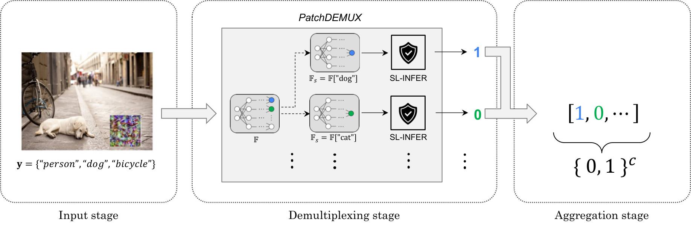

# PatchDEMUX: A Certifiably Robust Framework for Multi-label Classifiers Against Adversarial Patches
By [Dennis Jacob](https://djapp18.github.io/), [Chong Xiang](http://xiangchong.xyz/), [Prateek Mittal](https://www.princeton.edu/~pmittal/)

Code for "[PatchDEMUX: A Certifiably Robust Framework for Multi-label Classifiers Against Adversarial Patches](https://arxiv.org/abs/2505.24703)" in CVPR 2025. 

<div align="center">

</div>

**Takeaways**: 

1. We address the challenge of patch attacks in multi-label classification via PatchDEMUX, a defense framework that can provably extend any existing/future single-label defense.
2. Our framework provides *certifiable robustness*. Specifically, it provably guarantees lower bounds on performance (i.e., precision, recall) irrespective of the chosen patch attack.
3. We additionally propose location-aware certification, a novel approach that can provide tighter robustness bounds when an attacker is limited to a single patch.
4. We instantiate our defense framework with PatchCleanser, the current SOTA single-label defense, and achieve strong robust performance on MSCOCO and PASCALVOC. Precision-recall plots for unattacked MSCOCO images (left) and certified robustness on MSCOCO (right) are shown below. 

<div align="center">
 
</div>

## Requirements
Experiments were done with PyTorch 2.1.0 with CUDA enabled. The remaining packages used in this work can be found in `environment.yml` (i.e., the conda environment associated with this work).

A cluster of NVIDIA A100 40GB GPUs were used for evaluation. 

## Files

```shell
patchdemux/
├── certify/
│   ├── pd_certify.py                     # Main certification script for PatchDEMUX
│   ├── pd_certify_cached.py              # Cached certification using pre-computed outputs
│   └── pd_certify_cached_interpolate.py  # Interpolated certification from cached outputs
│
├── defenses/                             # Single-label CDPA implementations
│   └── patchcleanser/
│       ├── pc_certify.py                 # PatchCleanser certification
│       ├── pc_infer.py                   # PatchCleanser inference
│       └── pc_utils.py                   # PatchCleanser utility functions
│
├── inference/
│   ├── pd_infer.py                       # Main PatchDEMUX inference script
│   ├── pd_infer_cached.py                # Cached inference using pre-computed outputs
│   └── pd_infer_cached_interpolate.py    # Interpolated inference from cached outputs
│
├── performance/
│   └── inference_runtime.py              # Runtime evaluation for inference
│
├── preprocessing/
│   ├── generate_cached_outputs.py        # Caches model outputs, which can be used later when sweeping model thresholds
│   └── generate_greedy_cutouts.py        # Generate greedy cutout masks
│
├── scripts/                              # SLURM job scripts for running experiments
│
├── train/
│   ├── cutout_defense_finetuning.py      # Fine-tune models with cutout augmentation
│   ├── pascalvoc_transfer_learning.py    # Transfer learning for PASCALVOC dataset
│   └── train_utils.py                    # Training utility functions
│
├── utils/
│   ├── common.py                         # Common utility functions
│   ├── cutout_augmentations.py           # Cutout augmentation implementations
│   ├── datasets.py                       # Dataset loading and preprocessing
│   ├── metrics.py                        # Evaluation metrics
│   ├── model_ema.py                      # Exponential moving average for models
│   └── models.py                         # Model architectures and loading
│
├── environment.yml                       # Conda environment specification
├── pd_metrics_merge.py                   # Script to merge evaluation metrics
└── README.md                             # This file
```

## Usage
Evaluations are done using SLURM job scripts, which automatically populate the required arguments for the Python scripts. The SLURM parameters can be modified based on the desired experiment.

A key feature of the project is the presence of a caching API and a non-caching API. Many experiments can take a while to run; we thus provide the option to cache multi-label model outputs ahead of time, which can be used later when sweeping model thresholds for certification, inference, etc. To generate cached model outputs, run `preprocessing/generate_cached_outputs.py`. Then, run any of the scripts within the repository suffixed with the word *cached*. Note that while both APIs mostly agree quantitatively, the raw outputs are not always the exact same, likely due to rounding errors. 

If anything is unclear, feel free to contact Dennis Jacob (djacob18@berkeley.edu)!

## Models
Supports both ResNet (TResNet-L) and Vision Transformer (Q2L-CvT) architectures for multi-label classification. Model checkpoints are available at the following [Box location](https://berkeley.box.com/s/qjbi2p0vkxlhxmp4ms6zpiclhwz54e6o).

## Citations
If you find our work to be useful, please consider citing:

```tex
@inproceedings{Jacob_Xiang_Mittal_2025,
    title={PatchDEMUX: A Certifiably Robust Framework for Multi-label Classifiers Against Adversarial Patches},
    DOI={10.1109/CVPR52734.2025.00929},
    booktitle={2025 IEEE/CVF Conference on Computer Vision and Pattern Recognition},
    author={Jacob, Dennis and Xiang, Chong and Mittal, Prateek},
    year={2025},
    pages={9944–9953}
}
```
